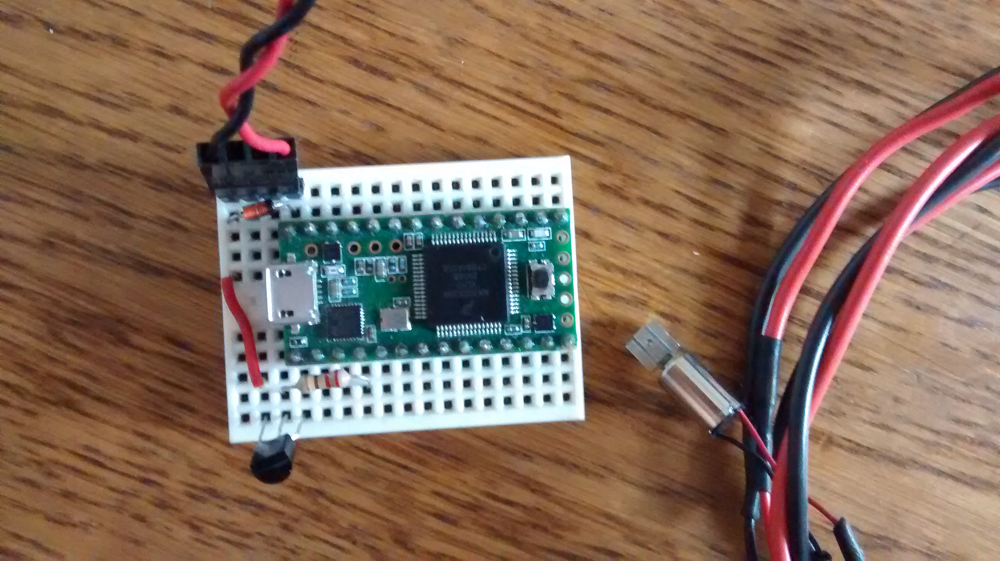

# DIY Vibro

Recherches pour la conception de modules accessibles pour faire vibrer n'importe quoi.
Pour le moment, trois objectifs:
* produire la documentation pour fabriquer un module minimal "récup" avec juste un transistor et un potentiomètre, avec vibreur et alimentation de récup.

Stack them together!

* concevoir et documenter un module vibrant connecté basé ESP8266 contrôlant un ou plusieurs vibreurs.
* proposer une API et quelques exemples de code de contrôle sans fil par UDP.

## References et liens sex toys

[Comingle](http://www.comingle.io) : LA référence mais c'est tout cassé, tout comme [Orgsmatronics](https://www.youtube.com/user/XTOrgasmatronics)

[Body Interaction](https://bodyinteraction.com/category/review/) semble prendre la suite ! Il a conçu une [carte](https://www.youtube.com/watch?v=BoJWXSxart0) de contrôle programmable avec un accéléro et une chip radio pour [30$](https://www.tindie.com/products/south/body-interaction-1-vibrator-development-board/) (vibreur et batterie comprise). Il fournit les modèles 3D de case (notamment en version [ring](www.youtube.com/watch?v=2dR11vYvjAw) !) et il a bien bossé sur l'ESP8266 : [Making of an ESP8266 Vibrator Development Board – traps and pitfalls](https://bodyinteraction.com)

Le [Fairy](https://www.neoplaisir.com/clitoridiens/1222-sextoy-clitoridien-fairy-lithium-sans-fil-1-4582272810281.html) semble être une bonne bête, pour seulement 60 euros ! Un prix à concurrencer :)

Quelques [photos](http://alarme.asso.fr/forum/index.php?topic=9303.0) d'un timide démontage du fameux Magic Wand.

Deux exemples de design de sex toy modulaire (seulement des projets de design, pas de commercialisation) : [InMe](https://www.masculin.com/sexualite/12456-sextoy-diy-inme/) et [Pillow Play](https://www.dezeen.com/2015/07/09/pillow-play-sex-toys-modular-vibrator-amber-defroand-brighton-university/)

[Vibease BT hacking](https://blog.safia.rocks/post/168431307225/what-i-learned-when-i-tried-to-hack-my-smart)

* Plus simple et moins cher, [tu meurs](https://www.youtube.com/watch?v=lMoBS8ePwow)
* Ultra cheap [USB model](https://www.youtube.com/watch?v=UntFt8kwo_g)

## References et liens électronique
* [Tuto](https://openclassrooms.com/courses/programmez-vos-premiers-montages-avec-arduino/le-moteur-a-courant-continu-partie-1-transistors-et-sorties-pwm) transistors et moteurs CC sur Openclassrooms.
* [Tuto](https://cdn.sparkfun.com/assets/resources/4/4/DC_motor_circuits_slides.pdf) pour contrôler un moteur avec un Arduino et un transistor par Sparkfun.
* [Tuto custom 555](http://www.instructables.com/id/Simple-and-dirty-Pulse-Width-Modulation-PWM-Wi/) précis et en 5V !
* [Circuit custom 555](https://www.youtube.com/watch?v=byYNei7FGmE)
* [Tuto 555 sans spec précises](http://www.instructables.com/id/555-DC-Motor-Speed-Control/)
* [Design compact ATTiny avec LED](https://sites.google.com/site/klaasdc/arduino-projects/tiny-battery-monitor)

## Journal de bord

06/02 : réflexion sur la version cheap en mattant des vidéos => un branchement en USB [en mode sale](http://www.instructables.com/id/USB-Mini-Drill/) c'est cool, récupérer un moteur de téléphone c'est cool aussi ! Par ailleurs une vidéo de tips confirme que les fréquences basses sont plus agréables et intéressantes, disons en-dessous de 100 Hz. Vérifions les specs des moteurs que j'ai sous la main :

* 324-401 : 0.2g@30Hz@20mA@3.3V, 0.6g@50Hz@50mA@5V, 1.5g@80Hz@100mA@9V
* 325-100 : 0.6g@65Hz@170mA@2.4V, 0.95g@80Hz@200mA@3V, 1.1g@90Hz@220mA@3.3V
* 310-112 : 0.5g@90Hz@30mA@1.5V
* 307-001 : 1.5g@100Hz@45mA@1.5V

TODO :
* pour chaque modèle de moteur, faire une versions ultracheap avec juste un interrupteur, une diode et un case pour une ou deux piles OU un cable USB
* faire une breadboard avec 555 + stuff, potar, baril jack femelle pour alim et JST femelle tester les moteurs sous des tensions variables

01/02 : Montage de test avec une Teesy, simple et rapide, pour tester les combinaisons de transistor/resistance. Utilise le 5V de l'USB fournit par le pin VIN de la Teensy. La Teensy pourra ensuite êre remplacée par une alimentation 5V et un transistor.

 
Test de 10 modèles de transistors, qui peuvent être triés en quatre groupes selon leur comportement.
Le code applique successivement différentes tensions différentes sur le pin (via analogWrite()) pour vérifier le comportement du moteur à différentes tensions => je ne dépassais pas 150, refaire les tests avec le code corrigé !

TODO
* vérifier la tension d'alim des moteurs de manette de jeu (12V ou 5V ?)
* faire un montage directement avec un potentiomètre (linéaire + log)

### Module "Récup"

### Module "WiFi"

### Applis de contrôle